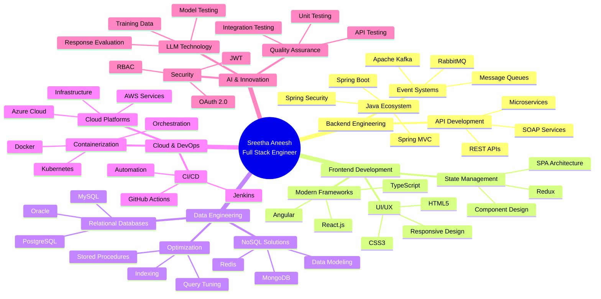

<!-- 
███████╗██████╗ ███████╗███████╗████████╗██╗  ██╗ █████╗     ███████╗███╗   ██╗███████╗███████╗███╗   ██╗██╗  ██╗
██╔════╝██╔══██╗██╔════╝██╔════╝╚══██╔══╝██║  ██║██╔══██╗    ██╔════╝████╗  ██║██╔════╝██╔════╝████╗  ██║██║  ██║
███████╗██████╔╝█████╗  █████╗     ██║   ███████║███████║    █████╗  ██╔██╗ ██║█████╗  █████╗  ██╔██╗ ██║███████║
╚════██║██╔══██╗██╔══╝  ██╔══╝     ██║   ██╔══██║██╔══██║    ██╔══╝  ██║╚██╗██║██╔══╝  ██╔══╝  ██║╚██╗██║██╔══██║
███████║██║  ██║███████╗███████╗   ██║   ██║  ██║██║  ██║    ███████╗██║ ╚████║███████╗███████╗██║ ╚████║██║  ██║
╚══════╝╚═╝  ╚═╝╚══════╝╚══════╝   ╚═╝   ╚═╝  ╚═╝╚═╝  ╚═╝    ╚══════╝╚═╝  ╚═══╝╚══════╝╚══════╝╚═╝  ╚═══╝╚═╝  ╚═╝
-->

<div align="center">

</div>

<div align="center">
  
[](https://git.io/typing-svg)

</div>

<div align="center">
  


</div>

---

## 📡 CONTACT MATRIX

<table align="center">
<tr>
<td align="center">
<a href="mailto:sreeanee2021@gmail.com">

</a>
</td>
<td align="center">

</td>
<td align="center">

</td>
</tr>
</table>

<div align="center">

[](https://www.linkedin.com/in/sreetha-aneesh-47a96130/)
[](https://github.com/sreeanee)
[](mailto:sreeanee2021@gmail.com)

</div>

---

## 💻 SYSTEM INITIALIZATION

```bash
┌─[sreetha@enterprise-architect]─[~/professional-profile]
└──╼ $ whoami
Sreetha Aneesh • Senior Full Stack Developer • Enterprise Software Engineer

┌─[sreetha@enterprise-architect]─[~/career-stats]
└──╼ $ ls -la
drwxr-xr-x  5+ years of full-stack development experience
drwxr-xr-x  40+ enterprise features delivered
drwxr-xr-x  15+ microservices architected
-rw-r--r--  25% average performance improvement
-rw-r--r--  20+ technology stack mastery
-rw-r--r--  3 major companies (PNC, Cigna, CitiusTech)
-rw-r--r--  100+ LLM evaluation scenarios completed

┌─[sreetha@enterprise-architect]─[~/specializations]
└──╼ $ cat expertise.txt
→ Full Stack Application Development (Java, Spring Boot, React, Angular)
→ Microservices Architecture & Distributed Systems
→ Cloud-Native Development (AWS, Azure, Docker, Kubernetes)
→ Enterprise Database Engineering (SQL, PostgreSQL, MySQL, Oracle, MongoDB)
→ LLM Model Testing & Evaluation
→ CI/CD Pipeline Development & DevOps Practices
→ API Development & System Integration

┌─[sreetha@enterprise-architect]─[~/current-status]
└──╼ $ echo $MISSION
Building scalable enterprise solutions that drive business value through 
innovative full-stack development, microservices architecture, and cutting-edge 
LLM technology integration.
```

---

## 🎯 PROFESSIONAL IDENTITY

<table width="100%">
<tr>
<td width="50%" valign="top">

```typescript
interface EnterpriseEngineer {
  name: string;
  role: string;
  expertise: TechStack;
  impact: Metrics;
}

class SreethaAneesh implements EnterpriseEngineer {
  name = "Sreetha Aneesh";
  role = "Senior Full Stack Developer";
  
  expertise: TechStack = {
    backend: [
      "Java", "Spring Boot", "Spring MVC",
      "Spring Security", "Node.js",
      "Microservices Architecture",
      "REST APIs", "Event-Driven Systems"
    ],
    frontend: [
      "React.js", "Angular", "TypeScript",
      "JavaScript", "Redux", "HTML5",
      "CSS3", "Responsive Design", "SPA"
    ],
    databases: [
      "PostgreSQL", "MySQL", "Oracle",
      "MongoDB", "Redis", "NoSQL",
      "Query Optimization", "Data Modeling"
    ],
    cloud: [
      "AWS", "Azure", "Docker",
      "Kubernetes", "Jenkins", "CI/CD"
    ],
    messaging: [
      "Apache Kafka", "RabbitMQ",
      "Event Streaming", "Message Queues"
    ],
    testing: [
      "JUnit", "Mockito", "Jest",
      "Cypress", "Selenium", "API Testing"
    ]
  };
}
```

</td>
<td width="50%" valign="top">

```python
class ImpactMetrics:
    """Quantified Professional Achievements"""
    
    def __init__(self):
        self.career_stats = {
            'experience_years': 5,
            'companies_served': 3,
            'enterprise_domains': [
                'Financial Services',
                'Healthcare Technology',
                'Enterprise Software'
            ],
            'features_delivered': 40,
            'microservices_built': 15,
            'api_integrations': 30,
            'performance_improvements': '25%',
            'defect_reduction': '20%',
            'test_scenarios_automated': 120,
            'application_releases': 38,
            'production_issues_resolved': 75,
            'llm_evaluation_prompts': 100,
            'training_data_examples': 500
        }
    
    def get_specialization(self):
        return {
            'primary': 'Full Stack Development',
            'secondary': 'Microservices Architecture',
            'emerging': 'LLM Model Evaluation',
            'strength': 'Enterprise-Scale Solutions'
        }
    
    def calculate_impact(self):
        return "Delivered scalable solutions across " \
               "financial services, healthcare, and " \
               "technology sectors with measurable " \
               "performance improvements and business value"
```

</td>
</tr>
</table>

---

## 🚀 TECHNOLOGY ARCHITECTURE



---

## 📊 DEVELOPMENT METRICS DASHBOARD

<div align="center">

<table>
<tr>
<td align="center" width="25%">

<br/>

</td>
<td align="center" width="25%">

<br/>

</td>
<td align="center" width="25%">

<br/>

</td>
<td align="center" width="25%">

<br/>

</td>
</tr>
<tr>
<td align="center" width="25%">

<br/>

</td>
<td align="center" width="25%">

<br/>

</td>
<td align="center" width="25%">

<br/>

</td>
<td align="center" width="25%">

<br/>

</td>
</tr>
</table>

</div>

---

## 🎓 ABOUT ME

I am a **Senior Full Stack Developer** with over **5 years** of comprehensive experience architecting and delivering enterprise-grade software solutions across **financial services**, **healthcare technology**, and **large-scale technology platforms**. My expertise spans the complete software development lifecycle, from conceptual architecture through production deployment and performance optimization.

### 🏆 Core Competencies

My technical foundation is built on **full-stack application development**, where I've successfully delivered **40+ enterprise features** using modern technology stacks including **Java**, **Spring Boot**, **React.js**, **Angular**, and **TypeScript**. I specialize in building **scalable microservices architectures** that have consistently delivered **25% performance improvements** and **20% defect reduction** across production environments.

### 💡 Technical Excellence

Throughout my career, I've demonstrated expertise in:

- **Backend Engineering**: Architected **15+ microservices** using Spring Boot, Spring MVC, and Spring Security, implementing robust REST APIs that handle millions of transactions. Integrated event-driven architectures using Apache Kafka and RabbitMQ to support asynchronous processing and improve system responsiveness.

- **Frontend Development**: Built responsive, user-centric interfaces using React.js and Angular, implementing state management with Redux and creating single-page applications that enhanced user experience across **10+ application modules**. Reduced frontend defect rework by **20%** through component-driven design and comprehensive testing.

- **Database Engineering**: